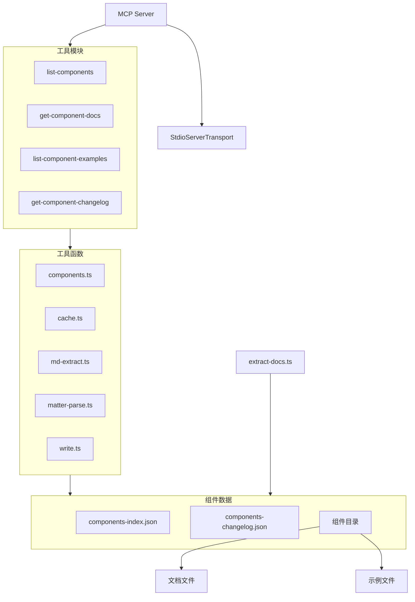
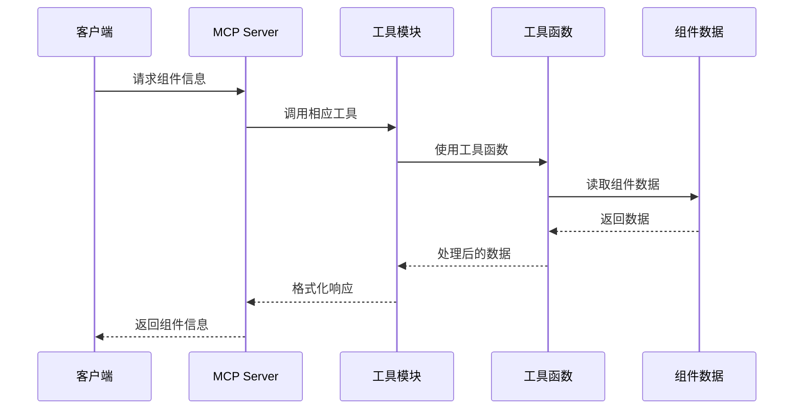
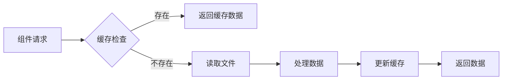

# Ant Design 组件库 MCP 服务

一个模型上下文协议(MCP)服务器，用于向 `Claude` 等大型语言模型(LLMs)提供 `Ant Design` 组件文档。该服务器允许 LLM 通过一组专用工具探索和理解 `Ant Design` 组件。

## 功能特性

- 已预处理数据，开箱即用(预处理版本为 `Ant Design V5.24.6 2025/4/12`)
  - 可以自行提取最新的/其他版本的组件文档
- 列出所有可用的 `Ant Design` 组件
  - 包含组件名称、描述、可用版本、何时使用当前组件信息
- 查看特定组件文档(已过滤无意义内容，对上下文友好)
- 查看特定组件属性和 API 定义
- 查看特定组件组件的代码示例
- 查看特定组件组件的更新日志
- 做了大量的缓存，有效缓解 IO 压力

## 后续计划

- [ ] 实现监听 Ant Design 组件库的更新，自动进行数据提取发版
- [ ] 考虑为工具调用添加上下文感知，如前文已获取，则返回："请使用前文获取的内容"
  - 通过 sessionId 处理
  - 客户端通常可以实现重新编辑对话，所以需要考虑当前情况
- [ ] 添加详细的 mcp tools 例子文档
- [ ] 考虑将提取的数据考虑放到CDN上，使用时实时获取
  - 实际上 npx 执行时会检测新版并安装新版本使用，目前可以保证数据实时性
- [ ] 考虑支持通过传参调整 tool 的注册来改善上下文
  - 目前部分 client 已支持手动开关单一工具：cline、github copilot等
- [ ] 考虑兼容 Ant Design 4.x 版本或者其他 UI 库
  - 如 Ant Design X 等系列组件库

## 什么时候需要自行提取组件文档？

1. 你想使用最新的组件文档
2. 你想使用其他版本的组件文档

### 组件文档

```bash
# 克隆 Ant Design 仓库
git clone https://github.com/ant-design/ant-design.git --depth 1 --branch master --single-branch --filter=blob:none

# 在当前目录执行提取文档命令
npx @jzone-mcp/antd-components-mcp extract [ant design repo path]  #默认提取路径为 ./ant-design
```

### 组件更新日志

组件更新日志提取依赖于 `Ant Design` 的 `scripts/generate-component-changelog.ts` 脚本，需要按照依赖后生成：

```bash
cd ant-design

pnpm install

# 生成组件更新日志 JSON
pnpm lint:changelog

# 提取组件信息
npx @jzone-mcp/antd-components-mcp extract [ant design repo path]
```

这将创建一个包含所有提取的组件文档的 data 目录，供 MCP 服务器使用。

## Claude桌面版集成

在Claude桌面版中使用此MCP服务器，编辑 `claude_desktop_config.json` 配置文件：

```json
{
  "mcpServers": {
    "Ant Design Components": {
      "command": "npx",
      "args": ["@jzone-mcp/antd-components-mcp"]
    }
  }
}
```

配置文件位置：

- macOS/Linux: `~/Library/Application Support/Claude/claude_desktop_config.json`
- Windows: `$env:AppData\Claude\claude_desktop_config.json`

## MCP Tools

服务器提供以下工具供LLM与Ant Design组件文档交互：

- `list-components`: 列出所有可用的 Ant Design 组件
- `get-component-docs`: 获取 Ant Design 特定组件的详细文档，不包含代码示例
- `list-component-examples`: 获取 Ant Design 特定组件的代码示例
- `get-component-changelog`: 列出 Ant Design 特定组件的更新日志

## 查询示例

可尝试的示例查询：

```text
Ant Design 有哪些可用组件？

上传图片示例后，使用 Ant Design 实现如图功能。

显示 Button 组件的文档。

Button 组件接受哪些属性？

显示 Button 组件的代码示例。

查看 Button 组件的基础用法。

查看 Button 组件的更新记录
```

## 工作原理

`scripts/extract-docs.ts` 脚本从 `Ant Design` 仓库提取文档并保存到 `componentData` 目录，包括：

- 组件文档(markdown格式)
- API/属性文档
- 示例代码
- 全量的更新日志

这种方法有几个优点：

1. 用户无需克隆整个Ant Design仓库
2. MCP服务器启动更快
3. 包体积更小
4. 新版本发布时更容易更新

当你要更新 Ant Design 文档时，只需执行 `npx @jzone-mcp/antd-components-mcp extract [ant design repo path]` 命令即可。

## 整体架构

以下是使用Mermaid绘制的项目架构图，展示了MCP Ant Design组件服务的主要模块和数据流向。



## 数据流向



## 组件数据结构


## 缓存机制


