<a href="https://glama.ai/mcp/servers/@zhixiaoqiang/antd-components-mcp">
  
</a>

[](https://www.npmjs.com/package/@jzone-mcp/antd-components-mcp)

<center>
<a href="./README.zh-CN.md">中文文档</a> | 
<a href="#ant-design-components-mcp-service">English Documentation</a>
</center>

# Ant Design Components MCP Service

A Model Context Protocol (MCP) server that provides `Ant Design` component documentation to large language models (LLMs) like `Claude`. This server allows LLMs to explore and understand `Ant Design` components through a set of dedicated tools.

**Articles：**

- [让 AI 更懂 Ant Design：MCP 协议在前端领域的落地实践](https://juejin.cn/post/7494106899646939173)

## Features

- 🚀 Pre-processed data, ready to use (Pre-processed version: `Ant Design V5.24.7 2025/4/16`)
  - 🔨 Can extract documentation for the latest/other versions
- 🔗 List all available `Ant Design` components
  - 📃 Includes component name, description, available versions, and when to use the component
- 📃 View specific component documentation (filtered for context-friendly content)
- 📃 View component properties and API definitions
- 📃 View code examples for specific components
- 📖 View changelog for specific components
- 💪 Extensive caching to effectively reduce IO pressure
- ⚙️ Pre-configured prompt to reduce repetitive tool calls (optimized for context)
  - 😺 Tested working with Claude client
  - 😩 Currently not working with github copilot/Cline plugins

## Roadmap

- [ ] Implement automatic data extraction when Ant Design components update
- [ ] Add context awareness for tool calls (e.g. return "Please use previously obtained content")
  - Handle via sessionId
  - Consider client-side conversation editing capabilities
- [ ] Add detailed MCP tools example documentation
- [ ] Consider hosting extracted data on CDN for real-time access
  - Currently npx checks for and installs new versions automatically
- [ ] Support adjusting tool registration via parameters to improve context
  - Some clients already support manual tool toggling (e.g. cline, github copilot)
- [ ] Consider compatibility with Ant Design 4.x or other UI libraries
  - Such as Ant Design X series components

## When to Extract Component Documentation Yourself?

1. You want to use the latest component documentation
2. You want to use documentation for other versions

### Component Documentation

```bash
# Clone Ant Design repository
git clone https://github.com/ant-design/ant-design.git --depth 1 --branch master --single-branch --filter=blob:none

# Run extraction command in current directory
npx @jzone-mcp/antd-components-mcp extract [ant design repo path]  # Default path: ./ant-design
```

### Component Changelog

Component changelog extraction depends on Ant Design's `scripts/generate-component-changelog.ts` script:

```bash
cd ant-design

pnpm install

# Generate component changelog JSON
pnpm lint:changelog

# Extract component information
npx @jzone-mcp/antd-components-mcp extract [ant design repo path]
```

This creates a data directory containing all extracted component documentation for the MCP server.

## Claude Desktop Integration

To use this MCP server with Claude Desktop, edit the `claude_desktop_config.json` configuration file:

```json
{
  "mcpServers": {
    "Ant Design Components": {
      "command": "npx",
      "args": ["@jzone-mcp/antd-components-mcp"]
    }
  }
}
```

Configuration file locations:

- macOS/Linux: `~/Library/Application Support/Claude/claude_desktop_config.json`
- Windows: `$env:AppData\Claude\claude_desktop_config.json`

## MCP Prompt

The server provides the following prompt for LLM interaction:

- `system-description`: Professional Ant Design components expert assistant that effectively reduces repetitive tool calls

> Note: For clients that don't support prompts, you can copy the following:

```text
# Role Definition
You are a professional Ant Design component library expert assistant, specializing in providing accurate and efficient component technical support.

## Skills
### Component Query
- Ability: Quickly search and list all available components
- Example: When asked "What form components are available?", list Form, Input, Select, etc.

### Documentation Parsing
- Ability: Precisely obtain component props, APIs and usage instructions
- Example: When asked about "Table component's pagination configuration", return the relevant props description

### Code Generation
- Ability: Provide complete, runnable code examples
- Requirement: Include necessary import statements and version information
- Example: Generate a Select component example code with search functionality

### Version Tracking
- Ability: Query component update history and change content
- Example: Answer "What changes were made to Modal component in v5.0.0"

## Rules
1. Context first: Prioritize using existing conversation information to avoid duplicate queries
2. Exact matching: Component names and props must exactly match the official documentation
3. Minimal tool calls: Avoid duplicate tool calls with same query parameters
4. Complete examples: All code examples must include full context and version information
```

## MCP Tools

The server provides these tools for interacting with Ant Design component documentation:

- `list-components`: List all available Ant Design components
- `get-component-docs`: Get detailed documentation for a specific Ant Design component (no code examples)
- `list-component-examples`: Get code examples for a specific Ant Design component
- `get-component-changelog`: List changelog for a specific Ant Design component

## Example Queries

Try these example queries:

```text
What Ant Design components are available?

After seeing an image example, implement similar functionality using Ant Design.

Show Button component documentation.

What properties does the Button component accept?

Show Button component code examples.

View basic usage examples for Button component.

View Button component changelog.
```

## How It Works

The `scripts/extract-docs.ts` script extracts documentation from the Ant Design repository and saves it to the `componentData` directory, including:

- Component documentation (markdown format)
- API/property documentation
- Example code
- Complete changelog

Advantages:

1. Users don't need to clone the entire Ant Design repository
2. Faster MCP server startup
3. Smaller package size
4. Easier updates when new versions are released

To update Ant Design documentation, simply run:
`npx @jzone-mcp/antd-components-mcp extract [ant design repo path]`

## Architecture

```mermaid
graph TD
    %% Main modules
    Server[MCP Server] --> Tools
    Server --> Transport[StdioServerTransport]
    
    %% Tool modules
    subgraph Tools[Tool Modules]
        ListComponents[list-components]
        GetDocs[get-component-docs]
        ListExamples[list-component-examples]
        GetChangelog[get-component-changelog]
    end
    
    %% Tool utility functions
    Tools --> Utils
    
    subgraph Utils[Utility Functions]
        Components[components.ts]
        Cache[cache.ts]
        MdExtract[md-extract.ts]
        MatterParse[matter-parse.ts]
        Write[write.ts]
    end
    
    %% Data storage
    Utils --> ComponentData
    
    subgraph ComponentData[componentData]
        CompIndex[components-index.json]
        CompChangelog[components-changelog.json]
        MetaData[metadata.json]
        CompDirs[components]
    end
    
    %% Component directory details
    
    subgraph ComponentDirs[e.g：alert]
        DocFiles[doc.md]
        ExampleFiles[examples.md]
    end

    CompDirs --> ComponentDirs
    
    %% Data extraction script
    Scripts[extract-docs.ts] --> ComponentData
```



## Data Flow


## Component Data Structure


## Caching Mechanism

