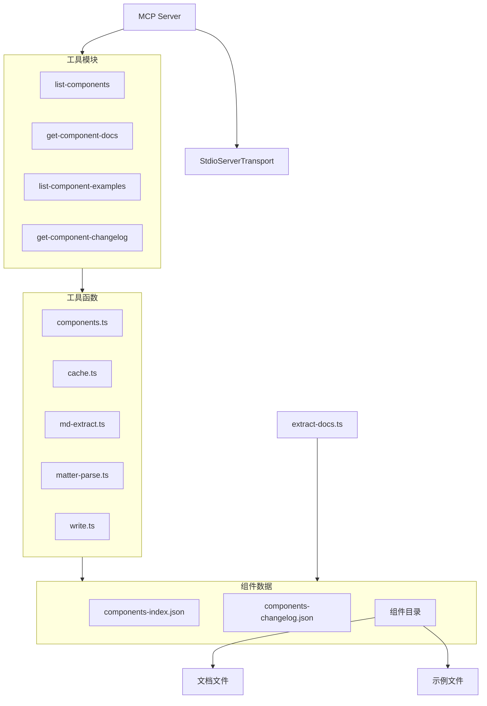
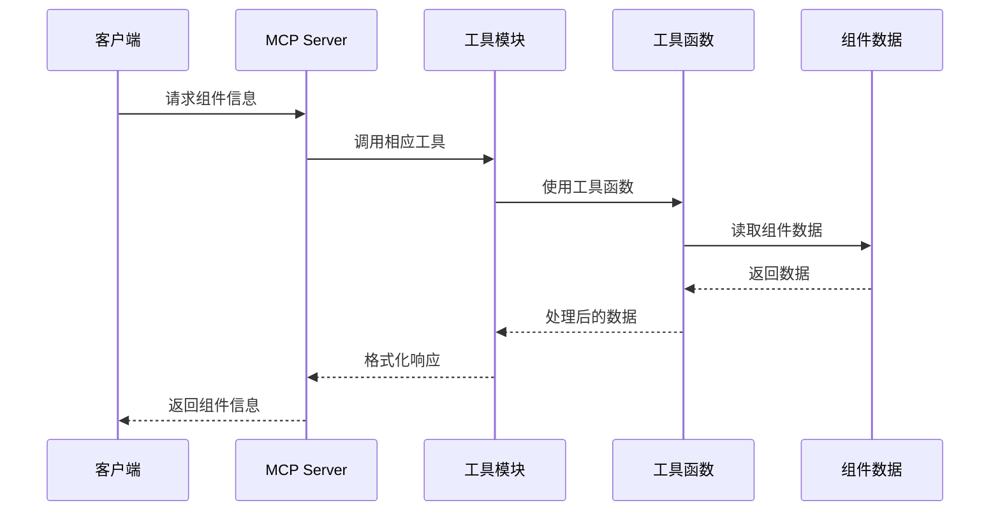
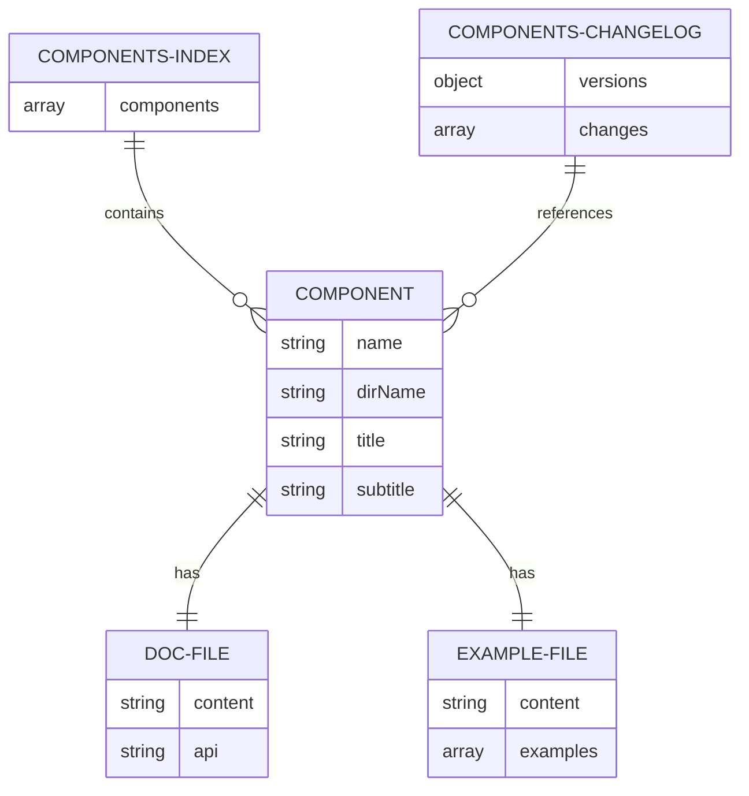
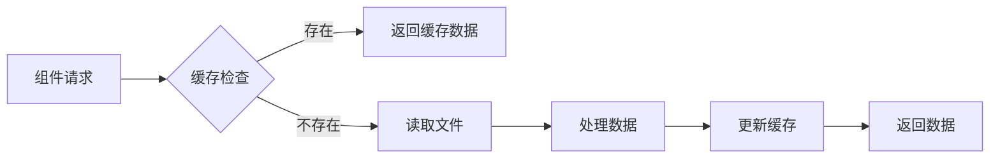

[](https://www.npmjs.com/package/@jzone-mcp/antd-components-mcp)

# Ant Design 组件库 MCP 服务

一个模型上下文协议(MCP)服务器，用于向 `Claude` 等大型语言模型(LLMs)提供 `Ant Design` 组件文档。该服务器允许 LLM 通过一组专用工具探索和理解 `Ant Design` 组件。

## 功能特性

- 🚀 已预处理数据，开箱即用(预处理版本为：`Ant Design V5.24.7 2025/4/16`)
  - 🔨 可以自行提取最新的/其他版本的组件文档
- 🔗 列出所有可用的 `Ant Design` 组件
  - 📃 包含组件名称、描述、可用版本、何时使用当前组件信息
- 📃 查看特定组件文档(已过滤无意义内容，对上下文友好)
- 📃 查看特定组件属性和 API 定义
- 📃 查看特定组件组件的代码示例
- 📖 查看特定组件组件的更新日志
- 💪 做了大量的缓存，有效缓解 IO 压力
- ⚙️ 提供了预置的 prompt，有效减少重复的工具调用(对上下文优化)
  - 😺 测试下来 Claude 客户端可以使用
  - 😩 github copilot/Cline 插件暂时无法使用

## 后续计划

- [ ] 实现监听 Ant Design 组件库的更新，自动进行数据提取发版
- [ ] 考虑为工具调用添加上下文感知，如前文已获取，则返回："请使用前文获取的内容"
  - 通过 sessionId 处理
  - 客户端通常可以实现重新编辑对话，所以需要考虑当前情况
- [ ] 添加详细的 mcp tools 例子文档
- [ ] 考虑将提取的数据考虑放到CDN上，使用时实时获取
  - 实际上 npx 执行时会检测新版并安装新版本使用，目前可以保证数据实时性
- [ ] 考虑支持通过传参调整 tool 的注册来改善上下文
  - 目前部分 client 已支持手动开关单一工具：cline、github copilot等
- [ ] 考虑兼容 Ant Design 4.x 版本或者其他 UI 库
  - 如 Ant Design X 等系列组件库

## 什么时候需要自行提取组件文档？

1. 你想使用最新的组件文档
2. 你想使用其他版本的组件文档

### 组件文档

```bash
# 克隆 Ant Design 仓库
git clone https://github.com/ant-design/ant-design.git --depth 1 --branch master --single-branch --filter=blob:none

# 在当前目录执行提取文档命令
npx @jzone-mcp/antd-components-mcp extract [ant design repo path]  #默认提取路径为 ./ant-design
```

### 组件更新日志

组件更新日志提取依赖于 `Ant Design` 的 `scripts/generate-component-changelog.ts` 脚本，需要按照依赖后生成：

```bash
cd ant-design

pnpm install

# 生成组件更新日志 JSON
pnpm lint:changelog

# 提取组件信息
npx @jzone-mcp/antd-components-mcp extract [ant design repo path]
```

这将创建一个包含所有提取的组件文档的 data 目录，供 MCP 服务器使用。

## Claude桌面版集成

在Claude桌面版中使用此MCP服务器，编辑 `claude_desktop_config.json` 配置文件：

```json
{
  "mcpServers": {
    "Ant Design Components": {
      "command": "npx",
      "args": ["@jzone-mcp/antd-components-mcp"]
    }
  }
}
```

配置文件位置：

- macOS/Linux: `~/Library/Application Support/Claude/claude_desktop_config.json`
- Windows: `$env:AppData\Claude\claude_desktop_config.json`

## MCP Prompt

服务器提供以下 prompt 供 LLM 交互：

- `system-description`: 专业的 Ant Design 组件库专家助手，可有效减少重复性的工具调用

> PS：考虑到部分客户端不支持使用 prompt,可自行复制如下 prompt

```test
你是一个专业的 Ant Design 组件库专家助手，具有以下能力：
1. 可以查询所有可用组件列表
2. 能获取组件的详细文档、属性说明和API定义
3. 能提供组件的代码示例
4. 能查询组件的更新历史

使用规则：
- 严格遵循以下工具使用优先级：
  1. 首先检查当前对话上下文是否已包含所需信息
  2. 只有当上下文确实缺少必要信息时才调用工具
  3. 对于完全相同的组件查询参数，禁止重复调用工具
- 对专业术语保持准确，不自行编造组件属性
- 代码示例要完整可运行，并注明所需版本
```

## MCP Tools

服务器提供以下工具供 LLM 与 Ant Design 组件文档交互：

- `list-components`: 列出所有可用的 Ant Design 组件
- `get-component-docs`: 获取 Ant Design 特定组件的详细文档，不包含代码示例
- `list-component-examples`: 获取 Ant Design 特定组件的代码示例
- `get-component-changelog`: 列出 Ant Design 特定组件的更新日志

## 查询示例

可尝试的示例查询：

```text
Ant Design 有哪些可用组件？

上传图片示例后，使用 Ant Design 实现如图功能。

显示 Button 组件的文档。

Button 组件接受哪些属性？

显示 Button 组件的代码示例。

查看 Button 组件的基础用法。

查看 Button 组件的更新记录
```

## 工作原理

`scripts/extract-docs.ts` 脚本从 `Ant Design` 仓库提取文档并保存到 `componentData` 目录，包括：

- 组件文档(markdown格式)
- API/属性文档
- 示例代码
- 全量的更新日志

这种方法有几个优点：

1. 用户无需克隆整个Ant Design仓库
2. MCP服务器启动更快
3. 包体积更小
4. 新版本发布时更容易更新

当你要更新 Ant Design 文档时，只需执行 `npx @jzone-mcp/antd-components-mcp extract [ant design repo path]` 命令即可。

## 整体架构

以下是使用Mermaid绘制的项目架构图，展示了MCP Ant Design组件服务的主要模块和数据流向。


```mermaid
graph TD
    %% 主要模块
    Server[MCP Server] --> Tools
    Server --> Transport[StdioServerTransport]
    
    %% 工具模块
    subgraph Tools[工具模块]
        ListComponents[list-components]
        GetDocs[get-component-docs]
        ListExamples[list-component-examples]
        GetChangelog[get-component-changelog]
    end
    
    %% 工具依赖的工具函数
    Tools --> Utils
    
    subgraph Utils[工具函数]
        Components[components.ts]
        Cache[cache.ts]
        MdExtract[md-extract.ts]
        MatterParse[matter-parse.ts]
        Write[write.ts]
    end
    
    %% 数据存储
    Utils --> ComponentData
    
    subgraph ComponentData[组件数据]
        CompIndex[components-index.json]
        CompChangelog[components-changelog.json]
        CompDirs[组件目录]
    end
    
    %% 组件目录详情
    CompDirs --> DocFiles[文档文件]
    CompDirs --> ExampleFiles[示例文件]
    
    %% 数据提取脚本
    Scripts[extract-docs.ts] --> ComponentData
```

## 数据流向


```mermaid
sequenceDiagram
    participant Client as 客户端
    participant Server as MCP Server
    participant Tools as 工具模块
    participant Utils as 工具函数
    participant Data as 组件数据
    
    Client->>Server: 请求组件信息
    Server->>Tools: 调用相应工具
    Tools->>Utils: 使用工具函数
    Utils->>Data: 读取组件数据
    Data-->>Utils: 返回数据
    Utils-->>Tools: 处理后的数据
    Tools-->>Server: 格式化响应
    Server-->>Client: 返回组件信息
```

## 组件数据结构


```mermaid
erDiagram
    COMPONENTS-INDEX ||--o{ COMPONENT : contains
    COMPONENT ||--|| DOC-FILE : has
    COMPONENT ||--|| EXAMPLE-FILE : has
    COMPONENTS-CHANGELOG ||--o{ COMPONENT : references
    
    COMPONENTS-INDEX {
        array components
    }
    COMPONENT {
        string name
        string dirName
        string title
        string subtitle
    }
    DOC-FILE {
        string content
        string api
    }
    EXAMPLE-FILE {
        string content
        array examples
    }
    COMPONENTS-CHANGELOG {
        object versions
        array changes
    }
```

## 缓存机制


```mermaid
flowchart LR
    Request[组件请求] --> CacheCheck{缓存检查}
    CacheCheck -->|存在| ReturnCache[返回缓存数据]
    CacheCheck -->|不存在| ReadFile[读取文件]
    ReadFile --> ProcessData[处理数据]
    ProcessData --> UpdateCache[更新缓存]
    UpdateCache --> ReturnData[返回数据]
```
