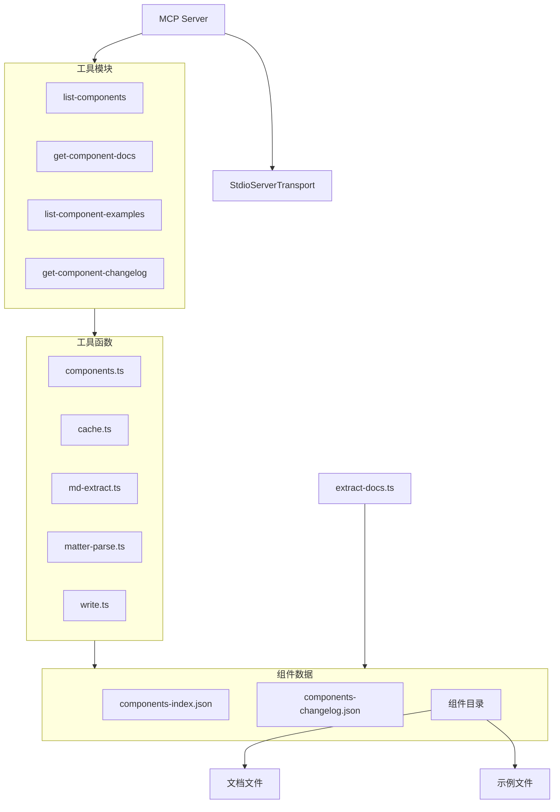
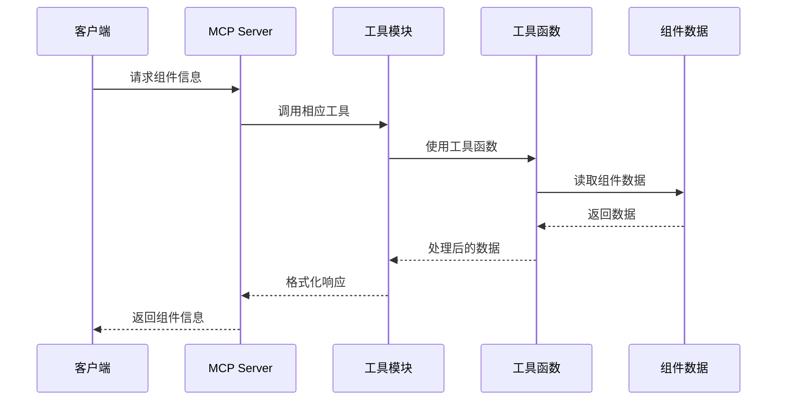
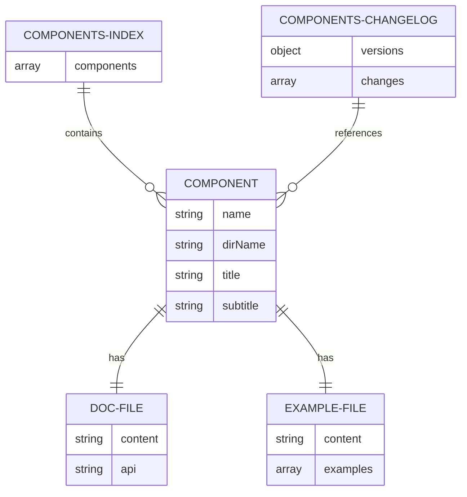
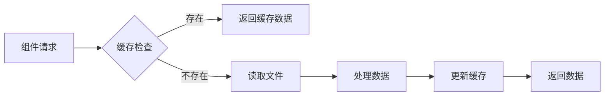

# MCP Ant Design 组件服务架构

以下是使用Mermaid绘制的项目架构图，展示了MCP Ant Design组件服务的主要模块和数据流向。

## 整体架构

```mermaid
graph TD
    %% 主要模块
    Server[MCP Server] --> Tools
    Server --> Transport[StdioServerTransport]
    
    %% 工具模块
    subgraph Tools[工具模块]
        ListComponents[list-components]
        GetDocs[get-component-docs]
        ListExamples[list-component-examples]
        GetChangelog[get-component-changelog]
    end
    
    %% 工具依赖的工具函数
    Tools --> Utils
    
    subgraph Utils[工具函数]
        Components[components.ts]
        Cache[cache.ts]
        MdExtract[md-extract.ts]
        MatterParse[matter-parse.ts]
        Write[write.ts]
    end
    
    %% 数据存储
    Utils --> ComponentData
    
    subgraph ComponentData[组件数据]
        CompIndex[components-index.json]
        CompChangelog[components-changelog.json]
        CompDirs[组件目录]
    end
    
    %% 组件目录详情
    CompDirs --> DocFiles[文档文件]
    CompDirs --> ExampleFiles[示例文件]
    
    %% 数据提取脚本
    Scripts[extract-docs.ts] --> ComponentData
```

## 数据流向

```mermaid
sequenceDiagram
    participant Client as 客户端
    participant Server as MCP Server
    participant Tools as 工具模块
    participant Utils as 工具函数
    participant Data as 组件数据
    
    Client->>Server: 请求组件信息
    Server->>Tools: 调用相应工具
    Tools->>Utils: 使用工具函数
    Utils->>Data: 读取组件数据
    Data-->>Utils: 返回数据
    Utils-->>Tools: 处理后的数据
    Tools-->>Server: 格式化响应
    Server-->>Client: 返回组件信息
```

## 组件数据结构

```mermaid
erDiagram
    COMPONENTS-INDEX ||--o{ COMPONENT : contains
    COMPONENT ||--|| DOC-FILE : has
    COMPONENT ||--|| EXAMPLE-FILE : has
    COMPONENTS-CHANGELOG ||--o{ COMPONENT : references
    
    COMPONENTS-INDEX {
        array components
    }
    COMPONENT {
        string name
        string dirName
        string title
        string subtitle
    }
    DOC-FILE {
        string content
        string api
    }
    EXAMPLE-FILE {
        string content
        array examples
    }
    COMPONENTS-CHANGELOG {
        object versions
        array changes
    }
```

## 缓存机制

```mermaid
flowchart LR
    Request[组件请求] --> CacheCheck{缓存检查}
    CacheCheck -->|存在| ReturnCache[返回缓存数据]
    CacheCheck -->|不存在| ReadFile[读取文件]
    ReadFile --> ProcessData[处理数据]
    ProcessData --> UpdateCache[更新缓存]
    UpdateCache --> ReturnData[返回数据]
```